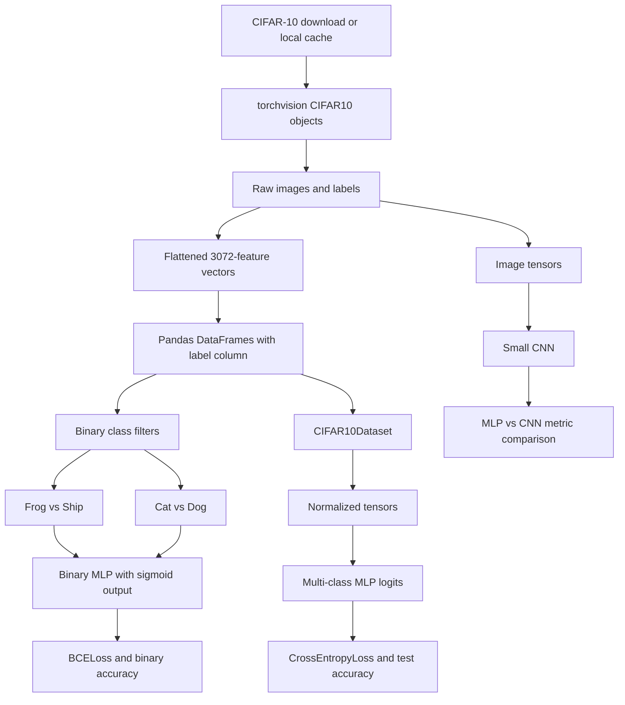

# HW4 CIFAR-10 Classification Architecture

This note documents the CIFAR-10 notebooks in the HW4 folder: the main submission notebook and the three experiment notebooks for Tasks 1.4, 1.5, and 3.

## Notebooks

- [`../../src/hw4/HW4_p1_CIFAR10_sub.ipynb`](../../src/hw4/HW4_p1_CIFAR10_sub.ipynb): main CIFAR-10 submission workflow.
- [`../../src/hw4/HW4_p1_task_1_4_exp.ipynb`](../../src/hw4/HW4_p1_task_1_4_exp.ipynb): frog-vs-ship binary classification experiments.
- [`../../src/hw4/HW4_p1_task_1_5_cat_dog_exp.ipynb`](../../src/hw4/HW4_p1_task_1_5_cat_dog_exp.ipynb): cat-vs-dog binary classification experiments.
- [`../../src/hw4/HW4_p1_task_3_exp.ipynb`](../../src/hw4/HW4_p1_task_3_exp.ipynb): multi-class CIFAR-10 MLP experiments plus CNN comparison.

## Data Flow

## Core Components

- `Net` in the main notebook implements binary classification with a flattened image input and a final `Sigmoid`.
- `train` and `evaluate` provide the shared binary training and evaluation loops.
- `CIFAR10Dataset` wraps flattened CIFAR-10 DataFrames for the multi-class task and normalizes features in `__getitem__`.
- `NetMCC` implements the multi-class fully connected classifier and returns logits for `CrossEntropyLoss`.
- `BinaryMLP` in the Task 1.4 and 1.5 experiment notebooks drives architecture, preprocessing, optimizer, and learning-rate sweeps.
- `CIFAR10ExperimentDataset`, `MLPClassifier`, `CIFAR10ImageDataset`, and `SmallCIFAR10CNN` in the Task 3 experiment notebook compare flattened MLPs against a spatial CNN.

## Path Conventions

The HW4 notebooks live one level below `src`, so local data paths are relative to `src/hw4`:

- CIFAR-10 cache: `../data/`
- fallback search roots in experiment notebooks: `../data`, `src/data`, then `data`
- main notebook experiment links: same-folder links to the three `HW4_p1_task_*_exp.ipynb` files

## Execution Notes

- Binary tasks use one output neuron and `Sigmoid` because the target is class 0 vs class 1.
- Multi-class tasks use ten output neurons and no final softmax because `CrossEntropyLoss` expects logits.
- The Task 3 experiment notebook keeps both MLP and CNN histories so it can plot train loss, test loss, and test accuracy by epoch.
- The CNN path keeps image structure as `3 x 32 x 32` tensors, while the MLP path flattens images to length `3072`.
