# Notebook Workspace Overview

This repository is organized around a notebook-centric learning architecture for the Nebius AI Performance Engineering course. Conceptually, the system has four layers: instructional notebooks, data and visual assets, a lightweight execution scaffold, and architecture notes that explain how the learning flows connect.

## Key idea

The repository is not structured as a deployable service. Instead, each notebook acts as a self-contained computational narrative that combines theory, implementation, experimentation, and interpretation.

## Diagram

```mermaid
flowchart TD
    A[Course Learning Goals] --> B[Optimization Notebooks]
    A --> C[Text Classification Homework]
    A --> D[CIFAR-10 Classification Homework]
    A --> E[RNN Language Modeling Homework]
    A --> F[Forward Pass Bonus]
    A --> G[Backward Pass Bonus]
    A --> H[Practice and Report Notebooks]

    B --> I[Gradient Flow]
    B --> J[PyTorch Autograd]
    B --> K[Optimizer Comparisons]

    C --> L[SST-2 Bag of Words]
    C --> M[Logistic Regression]

    D --> N[Flattened Image Features]
    D --> O[Binary and Multi-Class Nets]

    E --> P[Character Vocabulary]
    E --> Q[LSTM Training and Sampling]

    F --> R[NumPy Linear and Sigmoid Forward]
    G --> S[Manual Backpropagation]
    G --> T[Mini-Batch Training]

    B --> U[Visualization Assets]
    D --> V[CIFAR-10 Archive]
    H --> W[Notebook Theme]

    X[workspace package] --> Y[Tested execution entry point]
```

## Relevant files

- [`../../src/hw2/HW2_Gradient_descent_&_Pytorch.ipynb`](../../src/hw2/HW2_Gradient_descent_&_Pytorch.ipynb)
- [`../../src/hw1/HW_1_sub.ipynb`](../../src/hw1/HW_1_sub.ipynb)
- [`../../src/hw4/HW4_p1_CIFAR10_sub.ipynb`](../../src/hw4/HW4_p1_CIFAR10_sub.ipynb)
- [`../../src/hw4/HW4_p2_RNN_LM_sub.ipynb`](../../src/hw4/HW4_p2_RNN_LM_sub.ipynb)
- [`../../src/hw4/HW4_bon_p2_forward_sub.ipynb`](../../src/hw4/HW4_bon_p2_forward_sub.ipynb)
- [`../../src/hw4/HW4_bon_p1_backward_sub.ipynb`](../../src/hw4/HW4_bon_p1_backward_sub.ipynb)
- [`../../src/hw2/pytorch_optimization_report.ipynb`](../../src/hw2/pytorch_optimization_report.ipynb)
- [`../../src/Week_6_practice_session.ipynb`](../../src/Week_6_practice_session.ipynb)
- [`../../src/notebook_theme.css`](../../src/notebook_theme.css)
- [`01-cifar10-classification.md`](01-cifar10-classification.md)
- [`02-rnn-language-modeling.md`](02-rnn-language-modeling.md)
- [`03-forward-pass-framework.md`](03-forward-pass-framework.md)
- [`04-backward-pass-framework.md`](04-backward-pass-framework.md)

## Design implications

- notebooks are the primary execution units
- architecture is expressed through learning sequences rather than package modules
- datasets and visuals are colocated with the notebooks that consume them
- documentation is needed to make the conceptual structure explicit
- some submission notebooks are active working files and may still contain exercise placeholders or local execution state
