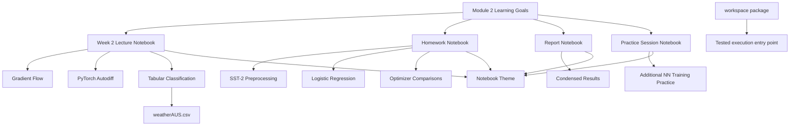

# Module Overview

This repository is organized around a notebook-centric learning architecture. Conceptually, the system has four layers: instructional notebooks, data and visual assets, a lightweight execution scaffold, and architecture notes that explain how the learning flows connect.

## Key idea

The repository is not structured as a deployable service. Instead, each notebook acts as a self-contained computational narrative that combines theory, implementation, experimentation, and interpretation.

## Diagram

## Relevant files

- [`../../src/LLM_Architectures,_week_2_Gradient_descent_&_Pytorch.ipynb`](../../src/LLM_Architectures,_week_2_Gradient_descent_&_Pytorch.ipynb)
- [`../../src/hw1_optimization_pytorch_polished.ipynb`](../../src/hw1_optimization_pytorch_polished.ipynb)
- [`../../src/pytorch_optimization_report.ipynb`](../../src/pytorch_optimization_report.ipynb)
- [`../../src/Week_6_practice_session.ipynb`](../../src/Week_6_practice_session.ipynb)
- [`../../src/notebook_theme.css`](../../src/notebook_theme.css)

## Design implications

- notebooks are the primary execution units
- architecture is expressed through learning sequences rather than package modules
- datasets and visuals are colocated with the notebooks that consume them
- documentation is needed to make the conceptual structure explicit
