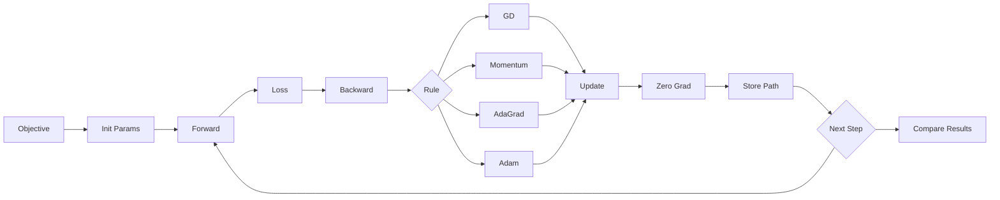

# Optimization Workflows

The optimization material in this repository moves from intuition to implementation within Module 2 of the [Nebius AI Performance Engineering](https://academy.nebius.com/ai-engineering-uk) course. The Week 2 lecture notebook introduces gradient flow and manual updates, while the homework notebook expands the idea into reusable optimizer routines such as plain gradient descent, momentum, AdaGrad, and Adam.

## Key idea

The architecture separates three concerns:

- define an objective function
- compute gradients through PyTorch autograd
- apply an update rule and record the resulting trajectory

## Diagram

## Where it appears

- `run_gd_pytorch` in the Week 2 lecture notebook demonstrates the basic optimization loop
- `gradient_descent`, `momentum`, `adagrad`, `rmsprop`, and `adam` in the homework notebook provide explicit optimizer implementations for comparison
- plotting helpers render trajectories and objective values to show how update rules behave on easy and difficult surfaces

## Relevant files

- [`../../src/hw2/HW2_Gradient_descent_&_Pytorch.ipynb`](../../src/hw2/HW2_Gradient_descent_&_Pytorch.ipynb)
- [`../../src/hw1/HW_1_sub.ipynb`](../../src/hw1/HW_1_sub.ipynb)
- [`../gradient_descent.gif`](../gradient_descent.gif)
- [`../gradient_descent_lr_0.1.gif`](../gradient_descent_lr_0.1.gif)

## Architectural significance

- optimizer behavior is made observable through stored parameter trajectories
- the same computational pattern supports both toy surfaces and real models
- PyTorch autograd is used as the common gradient engine even when update logic is implemented manually
