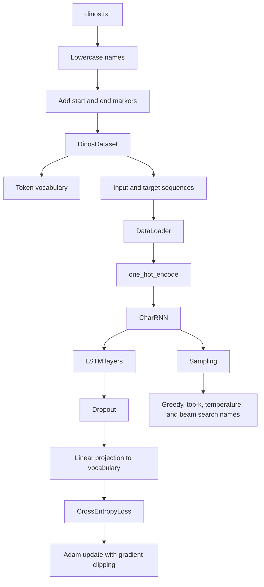
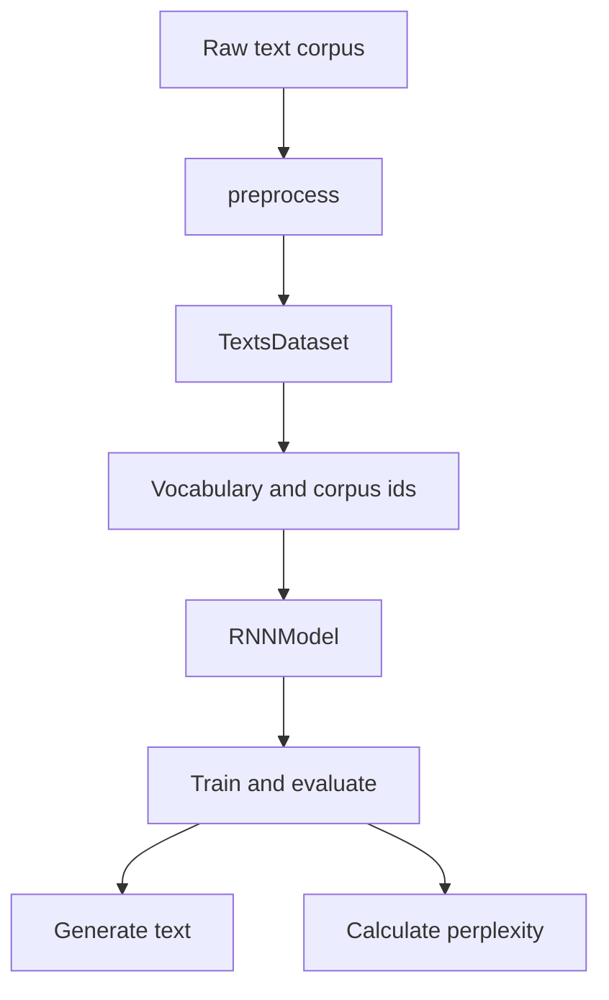

# HW4 RNN Language Modeling Architecture

This note documents the character-level dinosaur-name language model and the companion RNN demonstration notebook in the HW4 folder.

## Notebooks

- [`../../src/hw4/HW4_p2_RNN_LM_sub.ipynb`](../../src/hw4/HW4_p2_RNN_LM_sub.ipynb): homework submission for character-level dinosaur-name generation.
- [`../../src/hw4/RNN_demo.ipynb`](../../src/hw4/RNN_demo.ipynb): companion RNN language-modeling demonstration with preprocessing, training, generation, and perplexity evaluation.

## Dinosaur-Name Workflow

## Demo Workflow

## Core Components

- `DinosDataset` builds character vocabulary mappings and returns fixed-length input and target sequences.
- `one_hot_encode` converts integer character ids to `[batch, sequence, vocab]` model inputs.
- `CharRNN` combines `nn.LSTM`, dropout, and a linear vocabulary projection.
- `train` performs batched recurrent training with hidden-state detachment and gradient clipping.
- `predict`, `sample`, and `beam_search` implement character-by-character generation variants.
- `TextsDataset`, `RNNModel`, `train`, `evaluate`, `generate`, and `calculate_perplexity` in `RNN_demo.ipynb` show the same pattern on a broader text language-modeling example.

## Path Conventions

- The dinosaur names file is read from `../data/dinos.txt`.
- The first download cell writes to `../data/dinos.txt` so the data remains in the shared ignored `src/data/` directory.

## Execution Notes

- The homework notebook includes Apple Silicon device detection and uses `mps` when available.
- The model predicts the next character at every time step, so outputs are flattened across batch and sequence dimensions before cross-entropy loss.
- Hidden states are detached between batches to avoid backpropagating through the entire training history.
