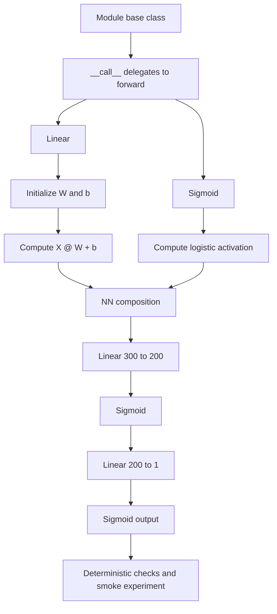

# HW4 Forward-Pass Framework Architecture

This note documents the NumPy forward-pass bonus notebook.

## Notebook

- [`../../src/hw4/HW4_bon_p2_forward_sub.ipynb`](../../src/hw4/HW4_bon_p2_forward_sub.ipynb): from-scratch forward-pass implementation for a small fully connected network.

## Flow

## Core Components

- `Module` defines the shared object interface and makes `model(x)` call `model.forward(x)`.
- `Linear` stores `W` and `b` and computes affine transformations.
- `Sigmoid` implements the elementwise logistic activation.
- `NN` composes layers in declaration order to produce a probability-like scalar output.

## Execution Notes

- The implementation is intentionally NumPy-based; Apple Silicon availability is checked, but the actual layer computation runs on CPU arrays.
- The notebook uses deterministic assertion cells to check output shapes and selected numerical values.
- This notebook is the conceptual precursor to [`04-backward-pass-framework.md`](04-backward-pass-framework.md), which adds gradients and parameter updates.
