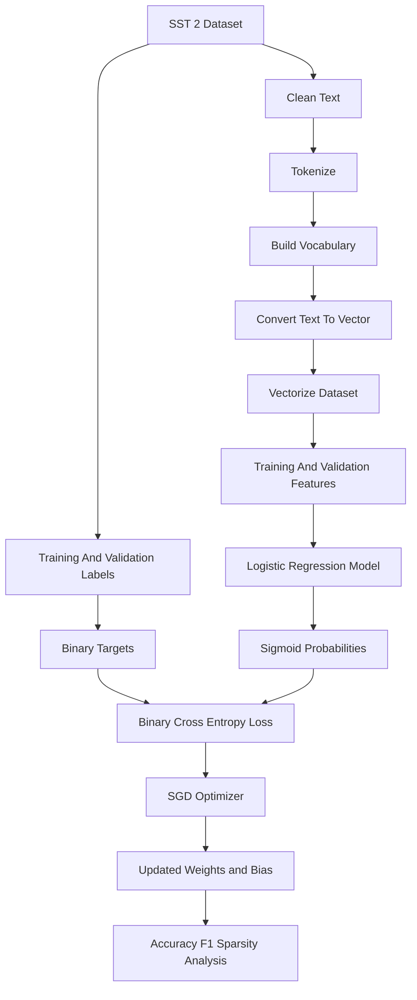

# Text Classification Pipeline

The homework notebook implements a classical NLP pipeline for binary sentiment classification on SST-2 as part of the [Nebius AI Performance Engineering](https://academy.nebius.com/ai-engineering-uk) course. This architecture intentionally avoids transformer abstractions and exposes the mechanics of preprocessing, feature construction, and SGD-based optimization.

## Key idea

The pipeline converts raw text into fixed-size bag-of-words vectors, then feeds those vectors into a manually defined logistic regression model in PyTorch.

## Diagram

## Where it appears

- `clean_text` normalizes raw text
- `tokenize`, `build_vocabulary`, `convert_text_to_vec`, and `dataset_to_vec` construct fixed-length numeric features
- `LogisticRegression` defines the linear classifier
- `sgd_logistic_regression` manages batching, loss computation, regularization, optimization, and metric logging

## Relevant files

- [`../../src/LLM_Architectures_hometask_1_submission.ipynb`](../../src/LLM_Architectures_hometask_1_submission.ipynb)
- [`../../src/LLM_Architectures_hometask_1_original.ipynb`](../../src/LLM_Architectures_hometask_1_original.ipynb)

## Architectural significance

- the pipeline makes feature engineering explicit
- model internals remain inspectable because weights are directly exposed
- L1 regularization is easy to reason about because the representation is sparse and linear
