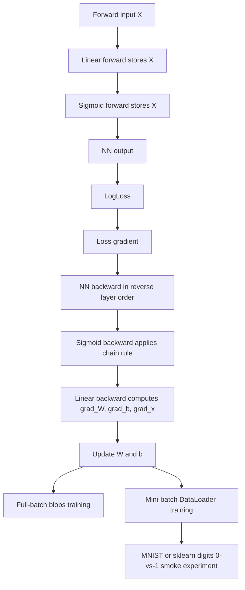

# HW4 Backward-Pass Framework Architecture

This note documents the NumPy backward-pass bonus notebook.

## Notebook

- [`../../src/hw4/HW4_bon_p1_backward_sub.ipynb`](../../src/hw4/HW4_bon_p1_backward_sub.ipynb): from-scratch backward-pass implementation, training loops, and MNIST/digits smoke experiment.

## Flow

## Core Components

- `Linear.backward` computes gradients for weights, bias, and layer input, then applies the learning-rate update.
- `Sigmoid.backward` multiplies the upstream gradient by the sigmoid derivative.
- `NN.backward` walks layers in reverse order and passes gradients backward.
- `LogLoss` computes binary log loss and the gradient with respect to model predictions.
- `train` performs full-batch gradient descent on synthetic two-class blobs.
- `DataLoader` and `train_stochastic` add shuffled mini-batch training.
- `load_binary_mnist_frames` uses optional local MNIST CSV files or a local sklearn digits fallback padded to 784 features.

## Path Conventions

- Optional MNIST CSV data is expected under `../data/MNIST_csv/`.
- If the CSV files are absent, the notebook falls back to sklearn digits `0`/`1`, so local smoke execution does not require downloading MNIST CSVs.

## Execution Notes

- The framework is NumPy-based, so GPU detection is informational for this notebook.
- Gradient checks are implicit through assertion cells, loss curves, and the final classification smoke experiment.
- The final section demonstrates how the same manual backpropagation components scale from synthetic blobs to image-like feature vectors.
