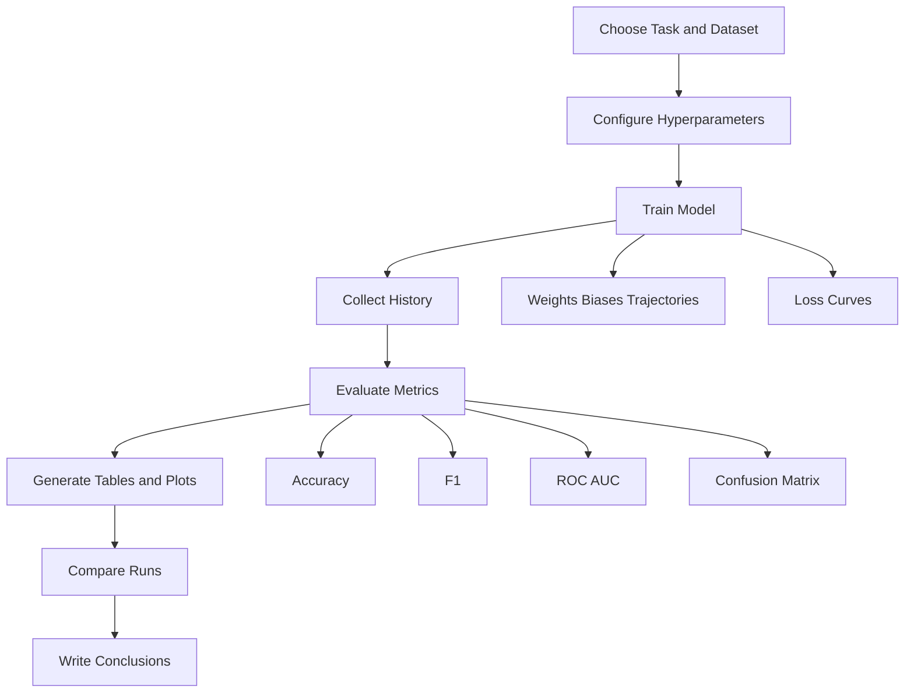

# Experimentation and Evaluation

The repository is designed not just to train models, but to compare decisions across the [Nebius AI Performance Engineering](https://academy.nebius.com/ai-engineering-uk) learning exercises. The notebooks repeatedly follow the same architecture: configure a model or optimizer, train it, evaluate it with metrics, and visualize the outcome for interpretation.

## Key idea

Experimentation is treated as a reusable loop with configurable knobs rather than a one-off script.

## Diagram

## Where it appears

- the homework notebook sweeps learning rate, batch size, initialization, and regularization settings
- the report notebook condenses selected experiments into a presentation-friendly summary
- the Week 2 notebook evaluates a tabular weather classification pipeline with standard metrics and preprocessing

## Relevant files

- [`../../src/hw1/HW_1_sub.ipynb`](../../src/hw1/HW_1_sub.ipynb)
- [`../../src/hw2/pytorch_optimization_report.ipynb`](../../src/hw2/pytorch_optimization_report.ipynb)
- [`../../src/hw2/HW2_Gradient_descent_&_Pytorch.ipynb`](../../src/hw2/HW2_Gradient_descent_&_Pytorch.ipynb)
- `../../src/data/weatherAUS.csv` local ignored cache for downloaded weather data

## Architectural significance

- experiments are structured to make tradeoffs visible rather than hidden
- metrics and plots are part of the architecture, not an afterthought
- the same evaluation pattern supports both tabular classification and text classification studies
