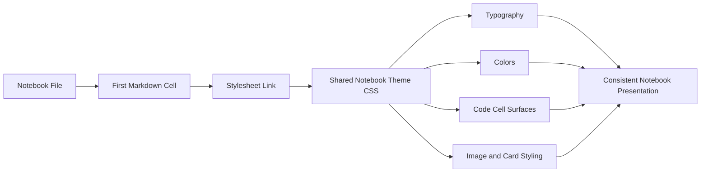

# Notebook Presentation Layer

The project uses a shared CSS file to provide consistent notebook styling inspired by Nebius Academy. This is a presentation architecture choice: styling is centralized in one place instead of being duplicated inside every `.ipynb` file.

## Key idea

Each notebook loads the same stylesheet through a small HTML reference cell. That keeps notebook JSON smaller and makes style changes global.

## Diagram

## Where it appears

- every notebook under `src/` begins with a stylesheet reference
- the CSS file defines the Nebius Academy-inspired palette, spacing, card treatment, and output styling

## Relevant files

- [`../../src/notebook_theme.css`](../../src/notebook_theme.css)
- [`../../src/LLM_Architectures,_week_2_Gradient_descent_&_Pytorch.ipynb`](../../src/LLM_Architectures,_week_2_Gradient_descent_&_Pytorch.ipynb)
- [`../../src/hw1_optimization_pytorch_polished.ipynb`](../../src/hw1_optimization_pytorch_polished.ipynb)
- [`../../src/pytorch_optimization_report.ipynb`](../../src/pytorch_optimization_report.ipynb)

## Architectural significance

- avoids repeated inline CSS across notebooks
- makes restyling low-risk and centralized
- keeps visual consistency across lecture, homework, and report artifacts
