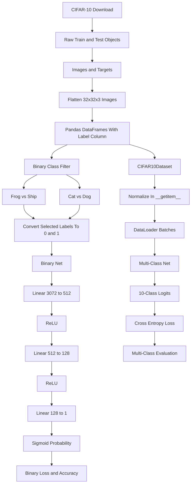

# CIFAR-10 Submission Flow

This note documents the task flow in the Week 4 CIFAR-10 submission notebook. The notebook moves from raw CIFAR-10 images to flattened tabular features, then uses PyTorch neural networks for binary and multi-class classification.

## Key idea

The task intentionally starts with flattened images instead of convolutional layers. That makes the shape transformations, label preparation, data loading, and fully connected network architecture explicit.

## Diagram

## Where it appears

- CIFAR-10 is loaded with `torchvision.datasets.CIFAR10`
- `train_dataset_raw.data` and `test_dataset_raw.data` are flattened into vectors of length `3072`
- filtered DataFrames prepare binary datasets for frog-vs-ship and cat-vs-dog tasks
- `Net` defines the binary fully connected classifier ending with `Sigmoid`
- `CIFAR10Dataset` is the intended custom `torch.utils.data.Dataset` wrapper for all ten classes
- the later task section sets up the multi-class network, loss, optimizer, train loop, and evaluation loop

## Relevant files

- [`../../src/hw4/HW4_p1_CIFAR10_sub.ipynb`](../../src/hw4/HW4_p1_CIFAR10_sub.ipynb)
- [`../../src/hw4/HW4_p1_task_1_4_exp.ipynb`](../../src/hw4/HW4_p1_task_1_4_exp.ipynb)
- [`../../src/hw4/HW4_p1_task_1_5_cat_dog_exp.ipynb`](../../src/hw4/HW4_p1_task_1_5_cat_dog_exp.ipynb)
- [`../../src/hw4/HW4_p1_task_3_exp.ipynb`](../../src/hw4/HW4_p1_task_3_exp.ipynb)
- [`01-cifar10-classification.md`](01-cifar10-classification.md)
- `../../src/data/` local ignored cache for downloaded CIFAR-10 data

## Task checkpoints

- decide the input size for flattened CIFAR-10 images: `32 * 32 * 3 = 3072`
- use one output neuron plus `Sigmoid` for binary probability output
- normalize image features before feeding them to the model
- use `model.train()` during training and `model.eval()` during evaluation when BatchNorm or Dropout are present
- use ten output neurons and cross-entropy-style training for the multi-class task
