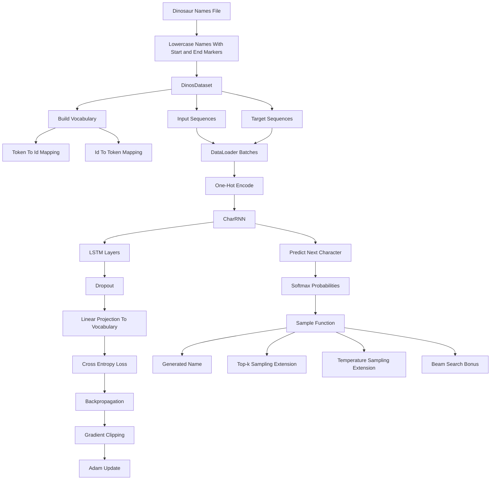

# RNN Language Model Submission Flow

This note documents the Week 4 character-level language-modeling submission notebook. The task builds a model that learns dinosaur-name character sequences and samples new names.

## Key idea

The notebook treats each dinosaur name as a sequence of characters, maps characters to integer ids, one-hot encodes batches, and trains an LSTM to predict the next character at every time step.

## Diagram

## Where it appears

- the notebook downloads `dinos.txt` and wraps names with `<` and `>` markers
- `DinosDataset` is the intended dataset wrapper for sequence extraction and vocabulary mappings
- `one_hot_encode` converts integer character ids into model inputs
- `CharRNN` combines `nn.LSTM`, `nn.Dropout`, and `nn.Linear`
- `train` uses Adam, cross entropy, hidden-state detachment, and gradient clipping
- `predict` and `sample` implement character-by-character generation
- later tasks extend generation with top-k sampling, temperature, and beam search

## Relevant files

- [`../../src/LLM_Architectures_W4_p2_homework_RNN_LM_submission.ipynb`](../../src/LLM_Architectures_W4_p2_homework_RNN_LM_submission.ipynb)
- [`../../src/LLM_Architectures_W4_p2_homework_RNN_LM_original.ipynb`](../../src/LLM_Architectures_W4_p2_homework_RNN_LM_original.ipynb)
- [`../../src/RNN_demo.ipynb`](../../src/RNN_demo.ipynb)

## Task checkpoints

- define sequence length and generate aligned input and target character ids
- maintain `token_to_id` and `id_to_token` mappings consistently
- use one-hot encoded tensors with shape `[batch_size, sequence_length, vocab_size]`
- flatten LSTM time-step outputs before the final linear vocabulary projection
- detach hidden state between batches so training does not backpropagate through the full history
- use top-k and temperature sampling to control generated-name diversity
