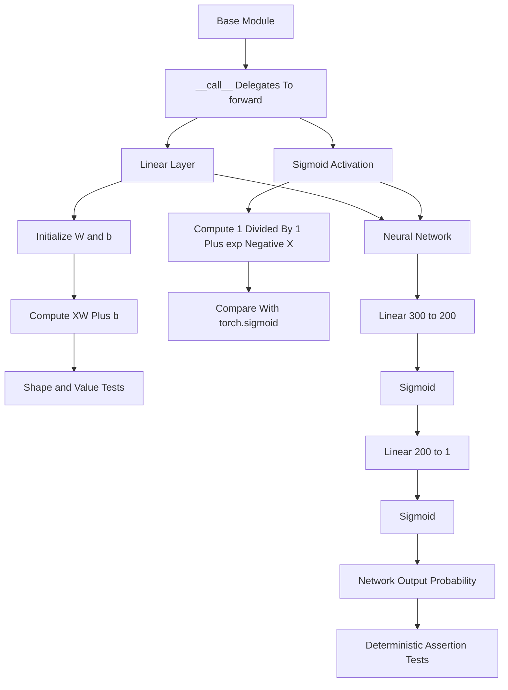

# Forward Pass Submission Flow

This note documents the Week 4 forward-pass bonus submission notebook. The task implements a tiny neural-network framework in NumPy before introducing backward propagation in the companion notebook.

## Key idea

The notebook builds the forward path from small reusable pieces: a base `Module`, a fully connected `Linear` layer, a `Sigmoid` activation, and a two-layer `NN` that composes them.

## Diagram

## Where it appears

- `Module` defines the shared interface and makes `model(x)` call `model.forward(x)`
- `Linear` stores the layer parameters and is intended to compute `x @ W + b`
- `Sigmoid` is intended to compute the elementwise logistic function
- `NN` wires the layers into a two-layer fully connected network
- deterministic tests validate shapes and selected numerical outputs

## Relevant files

- [`../../src/hw4/HW4_bon_p2_forward_sub.ipynb`](../../src/hw4/HW4_bon_p2_forward_sub.ipynb)
- [`03-forward-pass-framework.md`](03-forward-pass-framework.md)

## Task checkpoints

- implement `Linear.forward` as matrix multiplication plus bias
- implement `_sigmoid` using the logistic function
- pass data through layers in the same order they are declared
- preserve expected array shapes between layers
- use the assertion cells as local correctness checks for the forward pass
