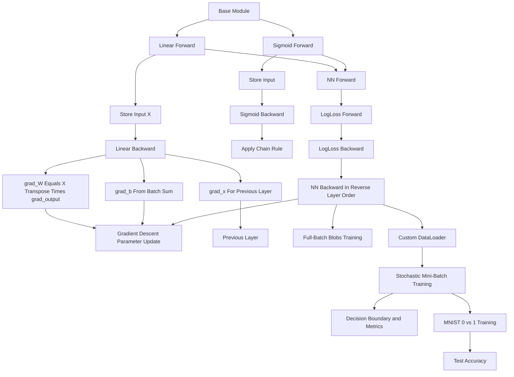

# Backward Pass Submission Flow

This note documents the Week 4 backward-pass bonus submission notebook. The task extends the NumPy neural-network framework with gradients, parameter updates, loss computation, full-batch training, mini-batch training, and simple image classification.

## Key idea

The notebook makes backpropagation explicit by storing forward-pass inputs, computing local gradients, passing gradients backward through the network, and updating trainable parameters inside each `Linear.backward` call.

## Diagram

## Where it appears

- `Linear.backward` is intended to compute gradients for weights, bias, and layer input, then apply a gradient descent step
- `Sigmoid.backward` is intended to multiply the incoming gradient by the derivative of sigmoid
- `NN.backward` is intended to call each layer's `backward` method in reverse order
- `LogLoss` computes binary log loss and its gradient with respect to predictions
- `train` performs full-batch training on a two-class synthetic dataset
- `DataLoader` shuffles data and yields mini-batches
- `train_stochastic` applies the same manual backpropagation loop over mini-batches
- the final section adapts the network to MNIST digit 0-vs-1 classification

## Relevant files

- [`../../src/hw4/HW4_bon_p1_backward_sub.ipynb`](../../src/hw4/HW4_bon_p1_backward_sub.ipynb)
- [`04-backward-pass-framework.md`](04-backward-pass-framework.md)
- `../../src/data/MNIST_csv/` optional local ignored MNIST CSV data directory

## Task checkpoints

- compute and return `grad_x` so earlier layers receive the correct gradient signal
- update `W` and `b` using the supplied learning rate inside `Linear.backward`
- implement sigmoid gradients through the chain rule
- compute log loss with an epsilon for numerical stability
- use reverse layer order during the backward pass
- compare full-batch and stochastic mini-batch training behavior
